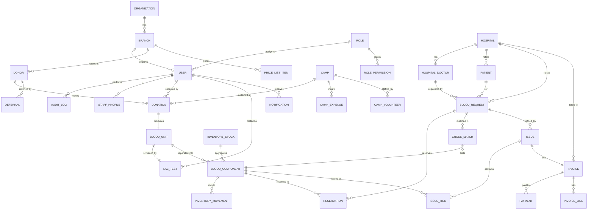

# Database Design — BloodLine BBMS

**Engine:** PostgreSQL 15+ · **ORM:** Prisma · **IDs:** UUID (v7-style, time-sortable) ·
**Money:** integer minor units · **Time:** `timestamptz` (UTC).

This document defines the logical model, relationships, indexes, constraints and
normalization rationale. The physical implementation lives in
[`packages/db/prisma/schema.prisma`](../packages/db/prisma/schema.prisma).

---

## 1. Design principles

1. **3NF baseline**, with deliberate, documented denormalizations (cached counters on
   `InventoryStock`) for hot-path dashboard reads.
2. **Every row is branch-scoped** (`branch_id`) for multi-branch isolation.
3. **Soft delete** (`deleted_at`) on clinical/financial entities; never hard delete.
4. **Audit everything** via a single append-only `AuditLog`.
5. **Lookups are enums** in code; reference data (price list, deferral reasons) are tables.
6. **Optimistic concurrency** via `version` (integer) on `BloodUnit`, `BloodComponent`,
   `InventoryStock`, `Invoice`.

---

## 2. ER Diagram

---

## 3. Core entities & key columns

### Identity & org
- **organization** (id, name, gstin, logo_url, settings jsonb)
- **branch** (id, org_id→organization, name, code, address, timezone, phone, license_no)
- **role** (id, name, is_system) · **permission** (id, module, action) ·
  **role_permission** (role_id, permission_id) · **user_permission_override** (user_id, permission_id, allow)
- **user** (id, branch_id, role_id, name, email ✦unique, phone, password_hash, status,
  last_login_at, mfa_enabled, deleted_at)
- **staff_profile** (id, user_id, department, join_date, ...) ·
  **attendance** (id, user_id, date, check_in, check_out, status) ·
  **leave_request** (id, user_id, from, to, type, status)

### Donor & collection
- **donor** (id, branch_id, donor_code ✦unique-per-branch, photo_url, name, dob, gender,
  blood_group, weight_kg, mobile, email, address, occupation, govt_id_type, govt_id_no,
  emergency_contact, status, donation_count, last_donation_at, next_eligible_at, deleted_at)
- **deferral** (id, donor_id, type [TEMP|PERMANENT], reason, start, until, by_user_id)
- **camp** (id, branch_id, name, location, scheduled_date, organizer, status, revenue_minor)
- **camp_volunteer** (id, camp_id, name, role) · **camp_expense** (id, camp_id, head, amount_minor)
- **donation** (id, branch_id, donor_id, camp_id?, collected_by_user_id, donation_type
  [VOLUNTARY|REPLACEMENT], source [WALK_IN|CAMP|HOSPITAL], collected_at, volume_ml, status)

### Unit, lab, component
- **blood_unit** (id, branch_id, donation_id ✦unique, bag_number ✦unique, blood_group,
  volume_ml, status [COLLECTED|PROCESSING|QUARANTINED|APPROVED|REJECTED|DISCARDED|SEPARATED],
  version)
- **lab_test** (id, unit_id ✦unique, hb, hiv, hbsag, hcv, malaria, syphilis [each
  REACTIVE|NON_REACTIVE|PENDING], forward_group, reverse_group, rh, antibody_screen,
  result [PENDING|APPROVED|REJECTED], tested_by_user_id, verified_by_user_id, comments,
  approved_at)
- **blood_component** (id, branch_id, unit_id→blood_unit, type [WHOLE_BLOOD|PRBC|PLATELETS|
  FFP|CRYO], blood_group, barcode ✦unique, volume_ml, storage_temp, storage_location,
  prepared_at, expires_at, status [AVAILABLE|RESERVED|ISSUED|EXPIRED|DISCARDED|QUARANTINED],
  version)
- **inventory_stock** (id, branch_id, blood_group, component_type, available, reserved,
  issued, expired, discarded, updated_at) — *cached counters; unique(branch,group,type)*
- **inventory_movement** (id, component_id, type [IN|RESERVE|RELEASE|ISSUE|EXPIRE|DISCARD|
  TRANSFER], qty, ref_type, ref_id, by_user_id, created_at) — *append-only ledger*

### Hospital, patient, request, issue
- **hospital** (id, branch_id, name, address, phone, email, gstin, credit_limit_minor,
  outstanding_minor, status)
- **hospital_doctor** (id, hospital_id, name, phone, specialization, reg_no)
- **patient** (id, branch_id, hospital_id?, name, age, gender, blood_group, diagnosis,
  doctor_id?, notes, status)
- **blood_request** (id, branch_id, patient_id?, hospital_id?, doctor_id?, channel
  [ONLINE|HOSPITAL|EMERGENCY], priority [CRITICAL|NORMAL], blood_group, component_type,
  units_requested, required_by, status [PENDING|APPROVED|REJECTED|COMPLETED|CANCELLED],
  approved_by_user_id, created_at)
- **reservation** (id, request_id, component_id, expires_at, status [HELD|RELEASED|CONSUMED])
- **cross_match** (id, request_id, component_id, patient_sample_ref, result [COMPATIBLE|
  INCOMPATIBLE|PENDING], technician_id, performed_at)
- **issue** (id, branch_id, request_id, patient_id, hospital_id?, doctor_id?, issued_by_user_id,
  issued_at, status [ISSUED|RETURNED|CANCELLED])
- **issue_item** (id, issue_id, component_id ✦unique, cross_match_id, price_minor)

### Billing
- **invoice** (id, branch_id, issue_id?, hospital_id?, patient_id?, number ✦unique, status
  [DRAFT|UNPAID|PARTIAL|PAID|VOID], subtotal_minor, gst_minor, total_minor, balance_minor,
  issued_at, version)
- **invoice_line** (id, invoice_id, description, qty, unit_price_minor, gst_rate, amount_minor)
- **payment** (id, invoice_id, method [CASH|CARD|UPI|CHEQUE|BANK], amount_minor,
  idempotency_key ✦unique, received_by_user_id, received_at)
- **expense** (id, branch_id, head, amount_minor, spent_at, by_user_id) — bank-level expenses
- **price_list_item** (id, branch_id, component_type, blood_group?, price_minor, gst_rate)

### Cross-cutting
- **notification** (id, branch_id, user_id?, channel [INAPP|EMAIL|SMS|WHATSAPP], type,
  payload jsonb, status [QUEUED|SENT|FAILED|READ], created_at, sent_at)
- **notification_outbox** (id, dedupe_key ✦unique, payload, attempts, next_attempt_at, status)
- **audit_log** (id, branch_id, user_id?, entity, entity_id, action, before jsonb, after
  jsonb, ip, user_agent, created_at) — *append-only, never updated/deleted*
- **setting** (id, branch_id?, key, value jsonb) — org/branch/feature-flag config

---

## 4. Relationships (cardinality summary)

| Parent | Child | Type | Notes |
|--------|-------|------|-------|
| Donor | Donation | 1‑N | one donor, many donations |
| Donation | BloodUnit | 1‑1 | each donation yields exactly one unit |
| BloodUnit | LabTest | 1‑1 | mandatory screening record |
| BloodUnit | BloodComponent | 1‑N | separation into components |
| BloodRequest | Reservation | 1‑N | holds matching components |
| BloodRequest | Issue | 1‑N | fulfilment(s) |
| Issue | IssueItem | 1‑N | components handed over |
| Issue | Invoice | 1‑1 | billing |
| Invoice | Payment | 1‑N | part payments |
| Hospital | BloodRequest | 1‑N | hospital demand |
| Camp | Donation | 1‑N | camp collections |

---

## 5. Indexes

Beyond every PK and FK (Prisma indexes FKs):

| Table | Index | Purpose |
|-------|-------|---------|
| donor | (branch_id, blood_group), (mobile), (govt_id_no), (next_eligible_at) | search/eligibility |
| donor | unique(branch_id, donor_code) | per-branch code |
| blood_component | (branch_id, blood_group, component_type, status), (expires_at) | inventory & expiry sweep |
| blood_component | unique(barcode) | scan lookup |
| blood_unit | unique(bag_number), (status) | scan & lifecycle |
| inventory_stock | unique(branch_id, blood_group, component_type) | upsert counters |
| inventory_movement | (component_id, created_at) | ledger by component |
| blood_request | (branch_id, status, priority), (required_by) | queue/dashboard |
| reservation | (request_id, status), (expires_at) | auto-release sweep |
| invoice | unique(branch_id, number), (status), (hospital_id) | finance |
| payment | unique(idempotency_key) | safe retries |
| audit_log | (entity, entity_id), (branch_id, created_at) | inspection |
| notification | (user_id, status), (branch_id, type, created_at) | inbox |

Partial/functional indexes (raw migration): `WHERE deleted_at IS NULL` on hot lists;
`WHERE status='AVAILABLE'` on `blood_component(expires_at)` for FEFO selection.

---

## 6. Constraints

- **FK** on every relationship; `ON DELETE RESTRICT` for clinical chains (no cascade that
  could erase traceability), `ON DELETE SET NULL` for optional references (e.g. camp).
- **CHECK**: `weight_kg >= 0`, `units_requested > 0`, `volume_ml > 0`,
  `total_minor = subtotal_minor + gst_minor`, `balance_minor >= 0`,
  `expires_at > prepared_at`.
- **UNIQUE**: bag_number, barcode, invoice number per branch, payment idempotency_key,
  donor_code per branch, email per org.
- **NOT NULL** on all clinical-critical columns (blood_group, status, expires_at).
- **Enum** types enforced at DB level via Prisma enums.

---

## 7. Normalization rationale

- **1NF**: no repeating groups; multi-valued data (volunteers, components, payments) are
  child tables.
- **2NF**: all non-key attributes depend on the whole key (composite junctions like
  `role_permission` carry no extra attributes besides the relationship).
- **3NF**: no transitive dependencies — e.g. hospital address lives on `hospital`, not
  copied onto every `blood_request`.
- **Deliberate denormalization**: `inventory_stock` caches counts that are *derivable* from
  `blood_component`/`inventory_movement`, maintained transactionally on every movement, to
  keep the dashboard O(1). `donor.donation_count`, `donor.last_donation_at`,
  `hospital.outstanding_minor` are likewise maintained counters with the ledger as source of
  truth and a nightly reconciliation job.

---

## 8. Transactions (must be atomic)

| Operation | Steps wrapped in one transaction |
|-----------|----------------------------------|
| Collect donation | create donation → create blood_unit → create pending lab_test → bump donor counters |
| Approve lab | update lab_test → set unit APPROVED → (optionally) create components → inventory_movement IN → upsert inventory_stock |
| Approve request | set request APPROVED → create reservations → movement RESERVE → update stock |
| Issue blood | verify cross-match → create issue + items → set components ISSUED → movement ISSUE → update stock → consume reservation → create draft invoice |
| Post payment | insert payment (idempotent) → recompute invoice balance/status → update hospital outstanding |

All use optimistic concurrency (`version`) to reject conflicting concurrent writes.
