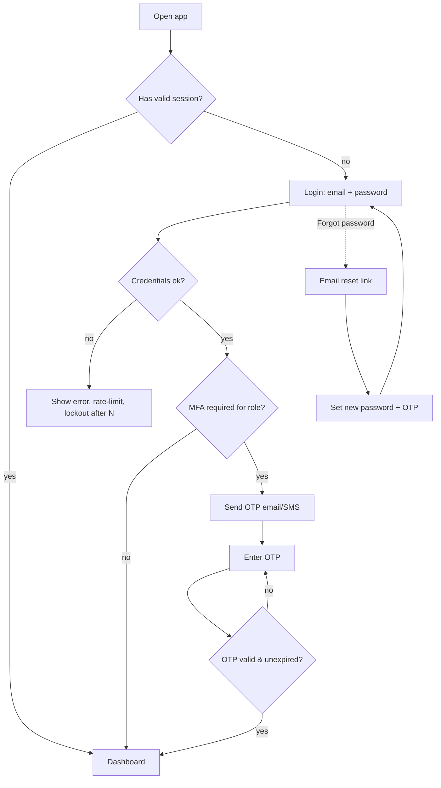
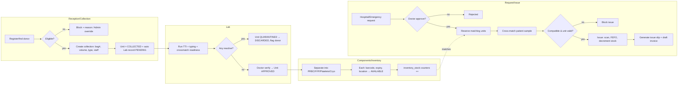
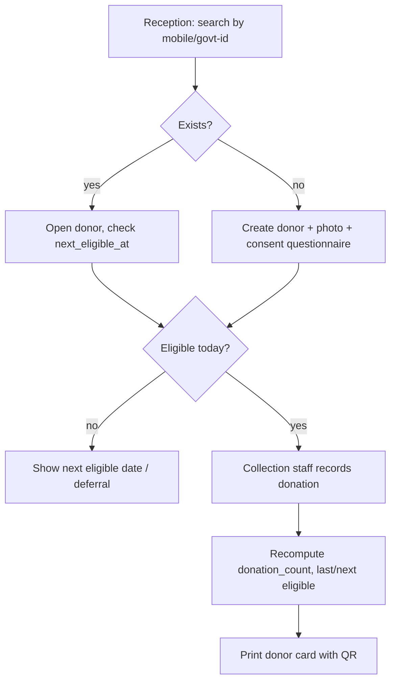
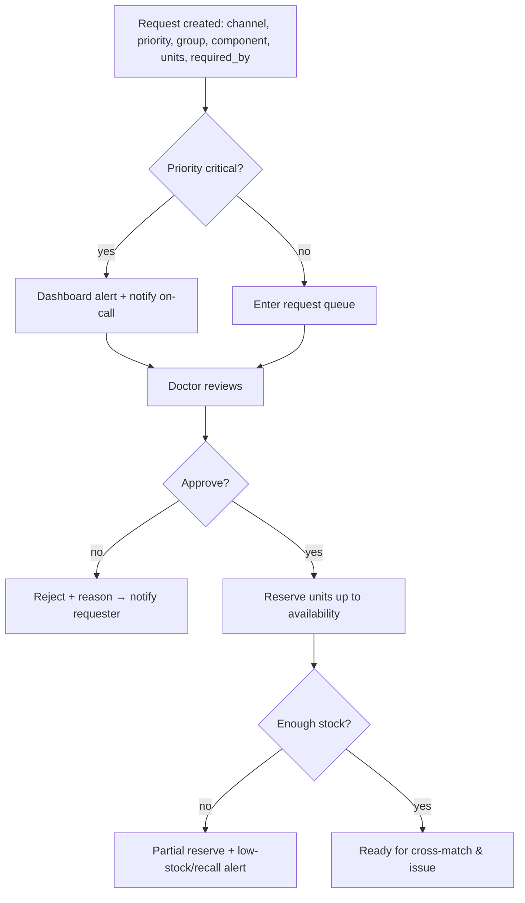
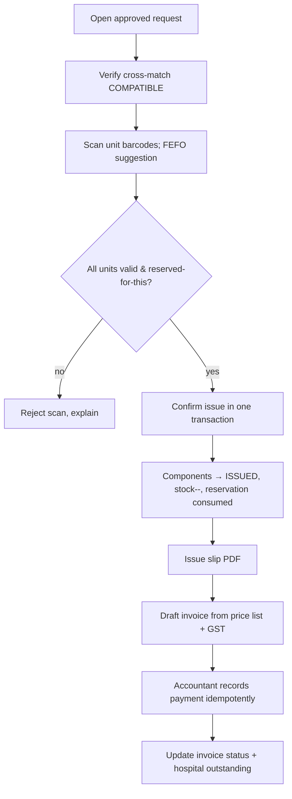
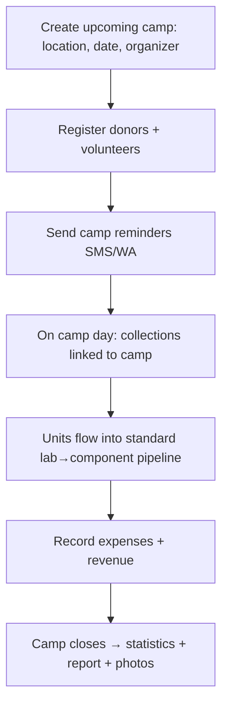
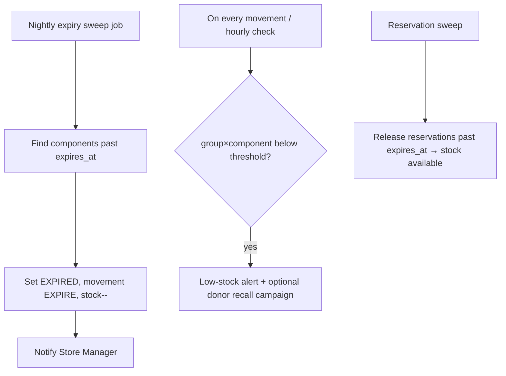
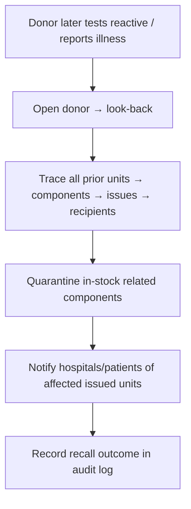

# User Flows — BloodLine

End-to-end flows for the core operations. Each flow names the role, the happy path and the
key guard rails (where the system blocks unsafe actions).

## 1. Authentication

## 2. The central blood lifecycle (collection → issue)

**Guard rails enforced server-side:** ineligible donor blocks collection; reactive TTI
discards the unit and it can never enter inventory; issue is impossible without an approved
request, a compatible cross-match, and a valid (approved, non-expired, not reserved-for-
other) unit.

## 3. Donor registration & donation (Reception → Collection Staff)

## 4. Blood request → approval → fulfilment (Hospital/Doctor/Store)

## 5. Issue & billing (Reception/Store → Accountant)

## 6. Camp lifecycle (Admin/Collection Staff)

## 7. Expiry & low-stock automation (system jobs)

## 8. Look-back / recall (Doctor/Admin — safety)

## 9. Role landing & access

| Role | Lands on | Primary daily flow |
|------|----------|--------------------|
| Super Admin / Admin | Dashboard | oversight, approvals, settings |
| Doctor | Requests queue | approve requests, verify lab/cross-match, look-back |
| Lab Technician | Lab worklist | TTI, typing, cross-match, component QA |
| Reception | Donors / Requests | register, intake, request entry, print cards |
| Data Entry | Imports | bulk capture & corrections |
| Accountant | Billing | invoices, payments, finance reports |
| Collection Staff | Collection | phlebotomy records, camp collection |
| Store Manager | Inventory | stock, expiry, discards, transfers |

Every flow writes an **audit_log** entry; every blocked action shows a clear,
human-readable reason.
